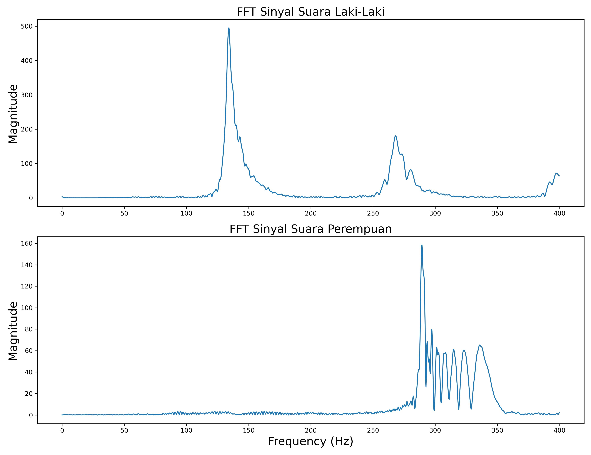
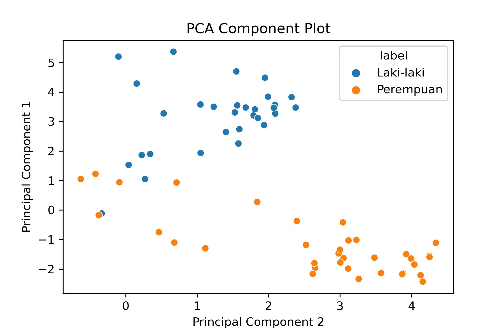

# Analysis of Male and Female Voices based on Time Domain Feature and Frequency Domain Feature
 
In this project, signal processing is performed to extract features that differentiate between male and female voices. Feature extraction will be carried out on both types of voices. Some of the feature extraction methods used in this project include Fast Fourier Transform (FFT), Time Domain Audio Features including RMSE and Zero Crossing Rate, and Frequency Domain Audio Features including Spectral Centroid and MFCC. Additionally, feature selection is performed using PCA on MFCC.

OBJECTIVES:
1. Analyze the differences between male and female voices.
2. Identify the characteristics of male and female voices.
3. Determine the suitable feature extraction methods to demonstrate the differences between male and female voices.

---
### Analisis Fast Fourier Transform (FFT)

+ Male voice signals have a dominant peak in the range of 110 - 200 Hz.
+ Female voice signals have peaks at higher frequencies ranging between 275 - 350 Hz

This indicates that male voices have a dominant lower frequency compared to female voices. Additionally, female voice signals have multiple peaks at higher frequencies after the highest peak. In contrast, male voice signals have a flatter shape at higher frequencies after the highest peak.

### PCA Operation

+ Feature selection and dimensionality reduction of MFCC features are performed.
+ Initially, MFCC has 20 features, which are now reduced to 2 features: PC 1 and PC 2.
+ Each principal component is plotted using a scatter plot.
+ Visualization between the two principal components shows that male and female voice signals extracted using MFCC features can be grouped, although there are some data points that are outliers.