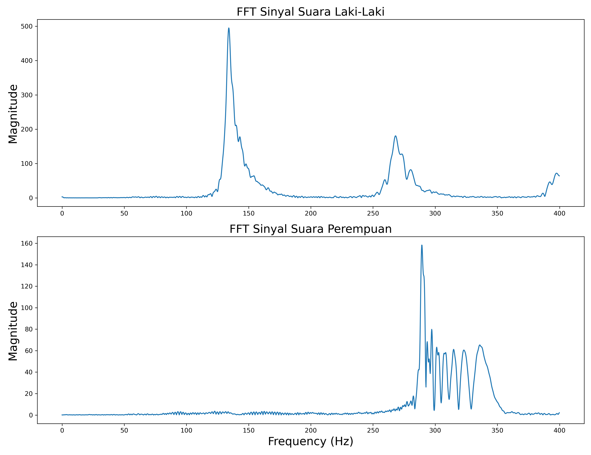

# Analisis Suara Laki-laki dan Perempuan berdasarkan Time Domain Feature dan Frequency Domain Feature
 
Pada projek ini dilakukan pengolahan suara untuk mendapatkan ciri yang membedakan suara dari laki-laki dan perempuan. Ekstraksi ciri akan dilakukan terhadap kedua jenis suara tersebut. Beberapa metode ektraksi ciri yang digunakan dalam projek ini antara lain, Fast Fourier Transform (FFT), Time Domain Audio Feature meliputi RMSE dan Zero Crossing Rate, dan Frequency Domain Audio Feature meliputi Spectral Centroid dan MFCC. Selain itu juga dilakukan feature selection menggunakan PCA dari MFCC.

TUJUAN:
1. Menganalisis perbedaan suara laki-laki dan perempuan.
2. Mengetahui ciri dari suara laki–laki dan perempuan.
3. Mengetahui jenis ekstraksi fitur yang cocok untuk menunjukkan perbedaan antara suara laki-laki dan perempuan

---
### Analisis Fast Fourier Transform (FFT)

+ Sinyal suara laki-laki memiliki peak yang dominan pada rentang 110 - 200 Hz.
+ Sinyal suara perempuan memiliki peak pada frekuensi lebih tinggi dan berkisar diantara 275 - 350 Hz.

Hal ini menandakan bahwa suara laki memiliki dominan frekuensi yang lebih rendah dari pada suara perempuan.
Selain itu, sinyal suara perempuan memiliki beberapa puncak pada frekuensi yang lebih tinggi setelah puncak tertinggi. Berbeda dengan sinyal suara laki-laki yang memliki bentuk landai pada frekuensi yang lebih tinggi setelah puncak tertingginya.

### PCA Operation

+ Feature Selection dan Dimensionality Reduction dari fitur MFCC dilakukan.
+ Pada awalnya MFCC mempunyai 20 fitur, sekarang menjadi 2 fitur, yaitu PC 1 dan PC2.
+ Masing-masing principal component diplot menggunakan scatterplot.
+ Visualisasi antara kedua principal component memperlihatkan bahwa sinyal suara laki-laki dan perempuan yang diekstrak menggunakan fitur MFCC dapat dikelompokkan meskipun ada beberapa titik data yang menjadi pencilan.